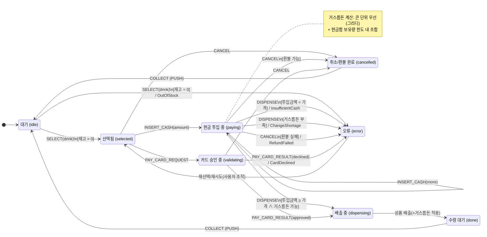

# Vending Machine (React + TypeScript)

## 실행 방법

### 요구 버전

Node.js ≥ 18.17 (LTS 권장)

npm ≥ 9
(yarn/pnpm 사용 가능하나, 본 문서는 npm 기준)

## 설치/실행

```bash
# 의존성 설치
npm i

# 개발 서버
npm run dev

# 프로덕션 빌드
npm run build

# 빌드 결과 미리보기
npm run preview
```

## 프로젝트 구조

```
├─ docs/
│  └─ (선택) vending-machine-diagram.md   # 머메이드 다이어그램
├─ src/
│  ├─ constants/
│  │  ├─ catalog.ts      # DRINKS (상품/가격)
│  │  ├─ errors.ts       # VMError (에러 코드)
│  │  ├─ messages.ts     # UI_MSG (상태/오류 메시지)
│  │  └─ policy.ts       # Policy (권종/초기 현금함/카드 승인율/초기 재고)
│  ├─ hooks/
│  │  └─ useVendingMachine.ts  # useReducer 훅(카드 승인 비동기 처리)
│  ├─ machine/
│  │  ├─ change.ts       # makeChange/applyChange (거스름돈 계산/현금함 반영)
│  │  ├─ reducer.ts      # 상태 머신 (SELECT/INSERT_CASH/…/CANCEL/COLLECT)
│  │  └─ state.ts        # 초기 인벤토리/카트 생성
│  ├─ types/
│  │  └─ domain.ts       # Currency/DrinkId/UiState/Inventory/Cart 등
│  ├─ App.tsx            # 자판기 UI + 액션 바인딩
│  ├─ App.css            # 스타일
│  └─ main.tsx           # 진입점
├─ index.html
├─ tsconfig.json
└─ package.json
```

## 사용 방법 (시나리오)

1. 상품 선택: 콜라/물/커피 중 하나를 클릭해 선택합니다.

2. 재고가 0이면 SOLD OUT으로 비활성화됩니다.

3. 결제

- 현금: 금액 버튼(₩100~₩10,000)으로 투입 → 투입 합계가 갱신됩니다.
- 카드: 카드 결제 클릭 → 승인 심사(비동기) 후 결과에 따라 진행됩니다.

4. 구매: 구매 클릭 → 조건 충족 시 상품 배출 및 거스름돈 계산/표시.

5. 취소/환불: 취소/환불 클릭 → 현금 투입분 환불 시도(거스름돈 부족 시 오류 메시지).

6. 수령(PUSH): 하단 PUSH(배출구)를 누르면 COLLECT → 거래가 초기화됩니다.

## 다이어그램



## 예외/에러 처리

- OutOfStock: 품절 상품 선택/구매 불가

- NotSelected: 미선택 상태에서 결제/구매 시도

- InsufficientCash: 투입 금액이 가격 미만

- ChangeShortage: 거스름돈 조합 불가(현금함 잔량 부족)

- RefundFailed: 환불 시 거스름돈 조합 불가

- CardDeclined: 카드 승인 실패(확률 기반 시뮬레이션)

*거스름돈/환불 계산은 그리디(큰 단위 우선) 로 수행하며, 현금함 보유량 한도를 초과하지 않습니다.
(구현: makeChange, applyChange)
